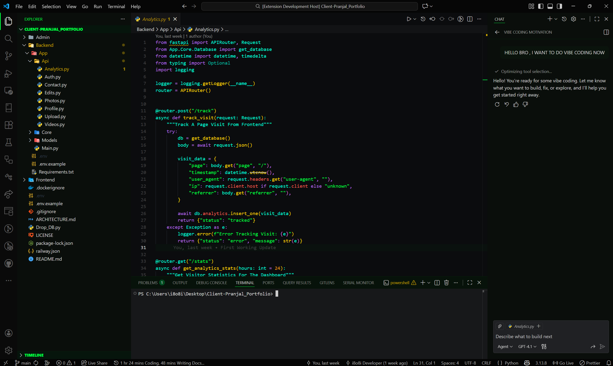
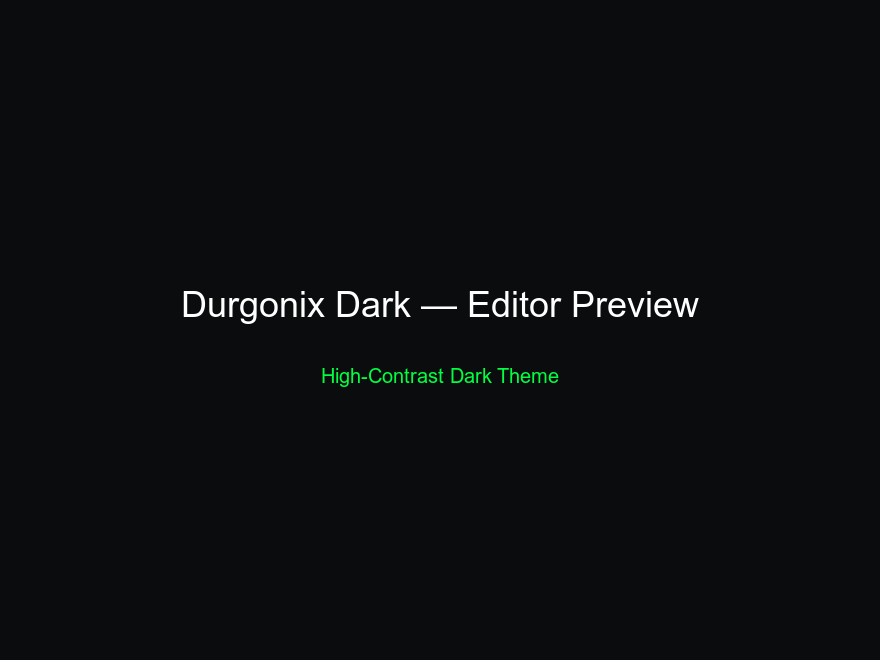
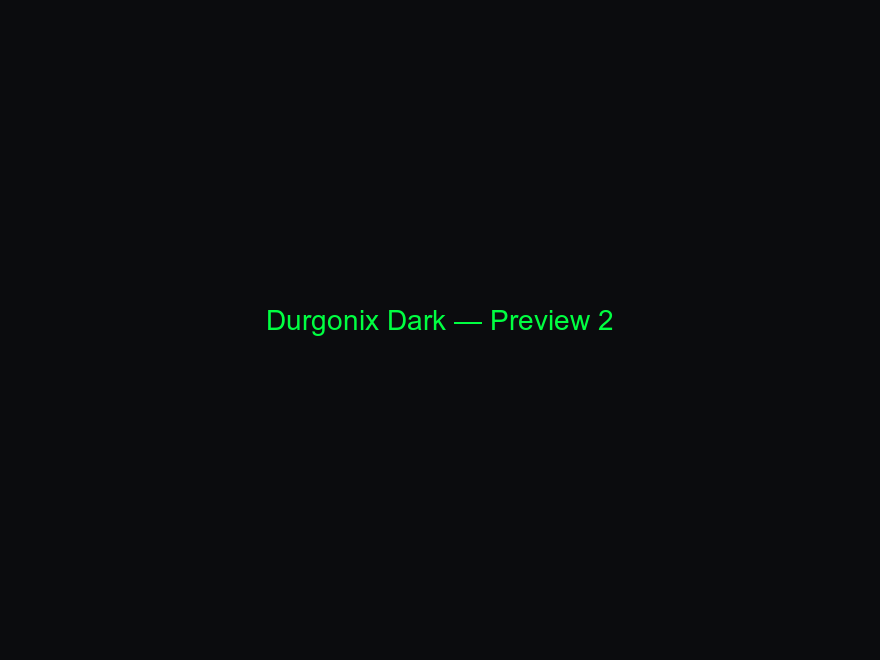

```                                                                                                                
  ▄▄▄▄▄▄                                             ▄▄▄▄▄▄                         ▄▄▄▄▄▄▄                            
 █▀██▀▀██                                           █▀██▀▀██                       █▀▀██▀▀▀▀ █▄                        
   ██   ██       ▄       ▄▄       ▄     ▀▀            ██   ██       ▄     ▄▄          ██     ██          ▄             
   ██   ██ ██ ██ ████▄▄████ ▄███▄ ████▄ ██▀██ ██▀     ██   ██ ▄▀▀█▄ ████▄ ██ ▄█▀      ██     ████▄ ▄█▀█▄ ███▄███▄ ▄█▀█▄
 ▄ ██   ██ ██ ██ ██   ██ ██ ██ ██ ██ ██ ██  ███     ▄ ██   ██ ▄█▀██ ██    ████        ██     ██ ██ ██▄█▀ ██ ██ ██ ██▄█▀
 ▀██▀███▀ ▄▀██▀█▄█▀  ▄▀████▄▀███▀▄██ ▀█▄██▄██ ██▄   ▀██▀███▀ ▄▀█▄██▄█▀   ▄██ ▀█▄      ▀██▄  ▄██ ██▄▀█▄▄▄▄██ ██ ▀█▄▀█▄▄▄
                         ██                                                                                            
                       ▀▀▀                                                                                                  
```

<div align="center" style="background:#0b0d0f;border-radius:12px;padding:28px 20px;margin-bottom:18px;color:#d6d6d6">
  
  <h1 style="margin:8px 0 6px 0;color:#ffffff">Durgonix Dark Theme</h1>
  <p style="margin:0 0 12px 0;color:#bfc7cf"><em>A High-Contrast Dark Theme With Neon Hacker-Green Accents</em></p>

  <p>
    
    
    
    
    
  </p>

  <p style="margin-top:12px;">
    <a href="#preview" style="text-decoration:none"></a>
    <a href="#QuickInstall" style="text-decoration:none"></a>
    <a href="#Contributing" style="text-decoration:none"></a>
    <a href="#Support" style="text-decoration:none"></a>
  </p>
</div>

## Preview

<p align="center">
  
</p>

## Highlights

**Feature Overview**

| Feature | Benefit | Example |
|---|---|---|
| High Contrast | Reduces Eye Strain And Improves Focus | Editor & Panels |
| Neon Accents | Draws Attention To Important UI Elements | Badges, Focus, Highlights |
| Accessibility | Better Contrast For Readable Tokens | JS/TS, Python, HTML |
| Multi-Language Tuning | Colors Set For Common Languages | JS/TS, Python, CSS |

---

## Showcase

<p align="center">
  <figure style="display:inline-block;margin:8px;text-align:center">
    
    <figcaption>Editor — File View</figcaption>
  </figure>
  <figure style="display:inline-block;margin:8px;text-align:center">
    
    <figcaption>Editor — Terminal & Panels</figcaption>
  </figure>
</p>

---

## Palette

<p align="center">
  <span style="display:inline-block;width:80px;height:28px;background:#0B0C0E;border-radius:5px;border:1px solid #111;margin:6px 8px"></span> <code>#0B0C0E</code>
  <span style="display:inline-block;width:80px;height:28px;background:#CFCFCF;border-radius:5px;border:1px solid #111;margin:6px 8px"></span> <code>#CFCFCF</code>
  <span style="display:inline-block;width:80px;height:28px;background:#007A2E;border-radius:5px;border:1px solid #003912;margin:6px 8px"></span> <code>#007A2E</code>
  <span style="display:inline-block;width:80px;height:28px;background:#004A1F;border-radius:5px;border:1px solid #001a0e;margin:6px 8px"></span> <code>#004A1F</code>
</p>

## Quick Install

```bash
# Install From Marketplace (when published):
code --install-extension i8o8i.durgonix-dark-theme

# Install From Local Package:
code --install-extension ./durgonix-dark-theme-1.0.0.vsix
```

## Recommended Settings

Add These To Your `settings.json` For Best Experience:

```json
{
  "workbench.colorTheme": "Durgonix Dark",
  "workbench.iconTheme": "vscode-icons",
  "editor.fontLigatures": false
}
```

## Customization

You Can Tweak Small Things Using `workbench.colorCustomizations` In Your Settings. Example To Force Badge Visibility:

```json
"workbench.colorCustomizations": {
  "badge.background": "#007A2E",
  "badge.foreground": "#FFFFFF",
  "panelTitleBadge.background": "#004A1F",
  "panelTitleBadge.foreground": "#FFFFFF"
}
```

## Contributing

- Fork Repo, Create Branch, Make Changes And Open A PR
- Include Screenshots For Visual Changes And Update Changelog

## Changelog

See `Changelog.md` For Release Notes And History.

## Support

Report Bugs Or Request Features At: https://github.com/i8o8i/Durgonix-Dark-Theme/issues

## License

MIT — See LICENSE File

---

<p align="center">Made With Love ❤️ — Durgonix Dark Theme</p>